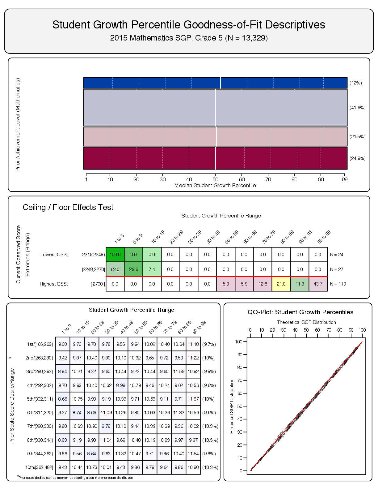

<!--SGPreport-->

<!-- Appendix A - Model Fit Plots -->

```{r, echo=FALSE, include=FALSE}
  require(SGP)
  require(Gmisc)

  ##  Set Table, Figure and Equation Counters
  options(table_counter=FALSE)
  options(table_number=0)
  options(table_counter_str = "<strong>Table A.%s:</strong> ")
  options("fig_caption_no"=0)
  options(fig_caption_no_sprintf = "**Fig. A.%s:**   %s")
	options("fig_caption_no_roman"=FALSE)
	options("equation_counter" = 0)
```

# Student Growth Percentile Fit Plots

A goodness of fit plot is produced for each unique analysis run in 2015.  Each analysis is defined by the grade and content area for the grade-level analyses and the unique course progression sequences for the end of course test (EOCT) subjects.

Each fit plot contains four panels.  The top panel is a mosaic plot that shows the percentage of students that fall into each proficiency level, and the location of the 10<sup>th</sup> through 90<sup>th</sup> quantiles of the Student Growth Percentile (SGP) distribution represented as dashed white lines (with the exception of the solid white line for the median/50<sup>th</sup> percentile).  

The "Ceiling/Floor Effects Test" panel is intended to help identify potential problems in SGP estimation at the Highest and Lowest Obtainable (or Observed) Scale Scores (HOSS and LOSS).  If is is relatively typical for extremely high (low) achieving students to consistently score at or near the HOSS (LOSS) each year, the SGPs for these students may be unexpectedly low (high).  The table of values shows whether the current year scale scores at both extremes yield the expected SGPs^[Note that the prior year scale scores are not represented here, but are critical in the SGP calculation of all students].  The expectation is that the majority of SGPs for students scoring at or near the LOSS will be low (preferably less than 5 and not higher than 10), and that SGPs for students scoring at or near the HOSS will be high (preferably higher than 95 and not less than 90).  Because few students may score *exactly* at the HOSS/LOSS, the top/bottom 50 students are selected and any student scoring within their range of scores are selected for inclusion in these tables.  Consequently, there may be a range of scores at the HOSS/LOSS rather than a single score, and there may be more than 50 students included in the HOSS/LOSS row if the 50 students at the extremes only contain the single HOSS/LOSS score.  Appendix C provides a more detailed analysis of potential ceiling and floor effects.

The bottom left panel shows the empirical distribution of SGPs given prior scale score deciles in the form of a 10 by 10 cell grid.  Percentages of student growth percentiles between the 10<sup>th</sup>, 20<sup>th</sup>, 30<sup>th</sup>, 40<sup>th</sup>, 50<sup>th</sup>, 60<sup>th</sup>, 70<sup>th</sup>, 80<sup>th</sup>, and 90<sup>th</sup> percentiles were calculated based upon the decile of the prior year's scaled score (the total students in each for the analyses varies depending on grade and subject).  Deviations from perfect fit are indicated by red and blue shading. The further above 10 the darker the red, and the further below 10 the darker the blue. A more detailed discussion about the reasons for and implications of model misfit for the various SGP analysis types can be found in the "Goodness of Fit" section of the 2015 Hawaii Student Growth Model report.  The bottom right panel of each plot is a Q-Q plot which compares the observed distribution of SGPs with the theoretical (uniform) distribution.

# Hawaii Smarter Balanced Assessment (SBA) Grade-Level Plots

## Reading

##### `r figCapNo("Goodness of Fit Plot for Grade 4 Reading, 2015.")` 


##### `r figCapNo("Goodness of Fit Plot for Grade 5 Reading, 2015.")`


##### `r figCapNo("Goodness of Fit Plot for Grade 6 Reading, 2015.")`


##### `r figCapNo("Goodness of Fit Plot for Grade 7 Reading, 2015.")`


##### `r figCapNo("Goodness of Fit Plot for Grade 8 Reading, 2015.")`


##### `r figCapNo("Goodness of Fit Plot for Grade 11 Reading, 2015.")`


<!-- HTML_Start -->
<!-- LaTeX_Start 
\clearpage
\pagebreak
LaTeX_End -->

## Mathematics

##### `r figCapNo("Goodness of Fit Plot for Grade 4 Mathematics, 2015.")`


##### `r figCapNo("Goodness of Fit Plot for Grade 5 Mathematics, 2015.")`


##### `r figCapNo("Goodness of Fit Plot for Grade 6 Mathematics, 2015.")`


##### `r figCapNo("Goodness of Fit Plot for Grade 7 Mathematics, 2015.")`


##### `r figCapNo("Goodness of Fit Plot for Grade 8 Mathematics, 2015.")`


##### `r figCapNo("Goodness of Fit Plot for Grade 11 Mathematics, 2015.")`


<!-- HTML_Start -->
<!-- LaTeX_Start 
\clearpage
\pagebreak
LaTeX_End -->


# Hawaii Equated Grade-Level Plots

In order to create student growth projections in the transition year(s) between the Hawaii State Assessment and the Smarter Balanced Assessment (SBA), the two tests must be equated to each other and SGP analyses conducted using the equated test scores^[The "equipercentile" equating method was used for this process.].  The following goodness of fit plots were produced for those analyses.

## Reading

##### `r figCapNo("Goodness of Fit Plot for Grade 4 Reading, 2015.")` 


##### `r figCapNo("Goodness of Fit Plot for Grade 5 Reading, 2015.")`


##### `r figCapNo("Goodness of Fit Plot for Grade 6 Reading, 2015.")`


##### `r figCapNo("Goodness of Fit Plot for Grade 7 Reading, 2015.")`


##### `r figCapNo("Goodness of Fit Plot for Grade 8 Reading, 2015.")`


<!-- HTML_Start -->
<!-- LaTeX_Start 
\clearpage
\pagebreak
LaTeX_End -->

## Mathematics

##### `r figCapNo("Goodness of Fit Plot for Grade 4 Mathematics, 2015.")`


##### `r figCapNo("Goodness of Fit Plot for Grade 5 Mathematics, 2015.")`


##### `r figCapNo("Goodness of Fit Plot for Grade 6 Mathematics, 2015.")`


##### `r figCapNo("Goodness of Fit Plot for Grade 7 Mathematics, 2015.")`


##### `r figCapNo("Goodness of Fit Plot for Grade 8 Mathematics, 2015.")`


<!-- HTML_Start -->
<!-- LaTeX_Start 
\clearpage
\pagebreak
LaTeX_End -->

