<!--SGPreport-->

```{r, echo=FALSE, include=FALSE}
  require(SGP)
  require(Gmisc)
	require(ggplot2)
	require(data.table)

  ## set a universal Cache path
  knitr::opts_chunk$set(cache.path = "_cache/Appendix_C_2015", fig.path="../img/Appendices/Appendix_C_2015/")

  ##  Set Table, Figure and Equation Counters
  options(table_counter=FALSE)
  options(table_number=0)
  options(table_counter_str = "<strong>Table C.%s:</strong> ")
  options("fig_caption_no"=0)
  options(fig_caption_no_sprintf = "**Fig. C.%s:**   %s")
  options("fig_caption_no_roman"=FALSE)
	options("equation_counter" = 0)
	
	GL_subjects <- c("READING", "MATHEMATICS")
	EOCT_subjects<-NULL

	prior.year <- "2014"
	current.year <- "2015"

	###  Set up long data
	long.data <- copy(Hawaii_SGP@Data[, c("ID", "VALID_CASE", "CONTENT_AREA",  "GRADE", "YEAR", "SCALE_SCORE", "SGP", "SCALE_SCORE_PRIOR", "SCALE_SCORE_PRIOR_STANDARDIZED", "SGP_NORM_GROUP"), with=FALSE][VALID_CASE=="VALID_CASE" & YEAR %in% c(prior.year, current.year)])
	# table(long.data[YEAR==current.year][, GRADE, CONTENT_AREA])
	##  Get max score lookup

	##  Top/Bottom 0.X% Can't do this with long.data.  Could try to get grade/subject specific pct value.  
	##  Might get close with EOGT, but not with EOCT (incomplete norm groups post preference based merge in combineSGP)
	#	pct <- .995
	# pct <- 50/dim(tmp.data.final)[1] # Take Top/Bottom 50 kids to find LOSS/HOSS

	setkeyv(long.data, c("CONTENT_AREA", "YEAR",  "GRADE", "SCALE_SCORE"))

	loss.hoss <- long.data[YEAR == current.year & !is.na(SGP)][, list(
		# LOSS_PCT = quantile(as.numeric(SCALE_SCORE), probs = 1-pct, na.rm = T), 
		LOSS_50 = SCALE_SCORE[which.min(SCALE_SCORE)+49], #  Bottom 50 Scores
# 		LOSS_2 = SCALE_SCORE[which.min(SCALE_SCORE)+1], #  Bottom 2 Scores
		LOSS_1 = min(SCALE_SCORE),   #  LOSS Only
		# HOSS_PCT = quantile(as.numeric(SCALE_SCORE), probs = pct, na.rm = T), 
		HOSS_50 = SCALE_SCORE[which.max(SCALE_SCORE)-49], #  TOP 50 Scores
		# HOSS_2 = SCALE_SCORE[which.max(SCALE_SCORE)-1], #  TOP 2 Scores
		HOSS_1 = max(SCALE_SCORE)   #  HOSS Only
		), keyby=list(CONTENT_AREA, YEAR, GRADE)]

	setkeyv(long.data, c("CONTENT_AREA", "YEAR", "GRADE"))
	long.data <- merge(long.data, loss.hoss, all.x = TRUE)
	long.data[, Grade := factor(as.numeric(GRADE))]

	# tmp_prior_grade <- sapply(as.character(long.data$SGP_NORM_GROUP), function(f) tail(strsplit(tail(strsplit(f, ";")[[1]],2)[1], "_")[[1]], 1))

	##  Subset out all students with max score and their historical long data

	max.data <- data.table(long.data[SCALE_SCORE >= HOSS_50 & !is.na(SGP),], key=c("ID", "CONTENT_AREA", "GRADE"))
	max.data[, CA := gsub("Sec ", "Secondary ", sapply(CONTENT_AREA, capwords))]
	min.data <- data.table(long.data[SCALE_SCORE <= LOSS_50 & !is.na(SGP),], key=c("ID", "CONTENT_AREA", "GRADE"))
	min.data[, CA := gsub("Sec ", "Secondary ", sapply(CONTENT_AREA, capwords))]

	###
	###  Utility functions for ggplot (necessary because use of ggplot(...) withing knitr is odd - can't find defined variables in envir/scope, just like data.table)
	###
	
	condDistPlot <- function(ca, g) {
		tmp.data <- subset(long.data, YEAR==current.year & CONTENT_AREA==ca & GRADE==g & !is.na(SCALE_SCORE_PRIOR), select=c(ID, SCALE_SCORE, SCALE_SCORE_PRIOR))

		if (g == "EOCT") {
			x.lab <- paste(current.year, gsub("Sec ", "Secondary ", capwords(ca)))
			y.lab <- "Prior Standardized Scores\n"
		}	else {
			x.lab <- paste(current.year, "Grade", g, capwords(ca))
			y.lab <- paste(prior.year, "Grade", g-1, capwords(ca))
		}

		ggplot(tmp.data, aes(x=SCALE_SCORE, y=SCALE_SCORE_PRIOR)) + geom_point(alpha=0.35) + theme_bw() + 
			geom_smooth(aes(x=SCALE_SCORE), colour='magenta', method="gam", formula =y ~ s(x, bs = "cs")) + 
			geom_rug(sides="tb", size=0.05, col=rgb(0.8,0,0,alpha=0.05)) + geom_rug(sides="rl", size=0.05, col=rgb(0,0,0.8,alpha=0.05)) +
			stat_density2d(data=tmp.data, geom="density2d",  aes(alpha = ..level..), colour='green', contour = TRUE) + #, size=1
			labs(y = y.lab, x = x.lab) + theme(axis.title=element_text(size=10, face="bold"), legend.position="none")
	}

	boxPlot <- function(tmp.data, y, LOSS=FALSE, facet=TRUE) {
		give.n <- function(x) { return(c(y = y, label = length(x))) }
		if (facet) {
			if (LOSS) {
				p <- ggplot(data=tmp.data, aes(x=CA, y=SGP, fill=Grade, ymax=(min(SGP) +10))) + 
						 geom_boxplot() + facet_grid(.~CA, scales="free") + labs(x="", y="Lowest Scoring Students' Growth Percentiles") 
			} else {
				p <- ggplot(data=tmp.data, aes(x=CA, y=SGP, fill=Grade, ymax=(min(SGP) -10))) + 
						 geom_boxplot() + facet_grid(.~CA, scales="free") + labs(x="", y="Highest Scoring Students' Growth Percentiles") 
			}
			p + stat_summary(fun.data = give.n, geom = "text", position=position_dodge(height = 0, width = 0.75), size=4, colour="red") +
					coord_flip() + theme(axis.title=element_text(size=12,face="bold"), axis.text.y = element_blank()) # +
		} else {
			if (LOSS) {
				p <- ggplot(data=tmp.data, aes(x=CA, y=SGP, fill=CA, ymax=(min(SGP) +7))) + 
						 geom_boxplot() + labs(x="Content Area", y="Lowest Scoring Students' Growth Percentiles")
			} else {
				p <- ggplot(data=tmp.data, aes(x=CA, y=SGP, fill=CA, ymax=(min(SGP) -7))) + 
						 geom_boxplot() + labs(x="Content Area", y="Highest Scoring Students' Growth Percentiles")
			}
			p + stat_summary(fun.data = give.n, geom = "text", position=position_dodge(height = 0, width = 0.75), size=4, colour="red") +
					coord_flip() + theme(axis.title=element_text(size=12,face="bold"), legend.position="none")
		}
	}
```


# Introduction
In the 2014-2015 academic year, Hawaii transitioned from the Hawaii State Assessment (HSA) to the [Smarter Balanced Assessment (SBA)](http://www.smarterbalanced.org). The transition included numerous changes to the assessment system including the incorporation of new performance standards and moving to a vertical scale.  As other states have gone through similar assessment transitions in 2014-2015, many have observed ceiling and floor effects in the new assessments (i.e. a relatively large proportion of students scoring at/near the scale extremes).  This has occurred despite purported improvements in assessment qualities that should prevent these effects (e.g. adaptive tests).  Regardless of the source of assessment ceilings/floors, they can make the Student Growth Percentile (SGP) estimates questionable.

Although very similar in nature, ceiling effects are somewhat more problematic than floor effects because consistently highest achieving students receive lower than expected growth percentiles and therefore the students are negatively impacted.  Conversely, consistently lowest achieving students have higher estimated SGPs than would be expected.  Although this could be interpreted as a positive impact on these students by giving them higher SGPs, it can also conceals unacceptably low growth.  

Essentially these problems are caused by the way in which a "percentile" is defined to begin with, and the inability of the assessments (and therefore the SGP model) to make granular distinctions between kids who score at the extremes of the test year after year.  As an example, if a group of students were tested with a relatively easy test and 20% of the students had a perfect score, these students would be defined as being in the 80<sup>th</sup> percentile because they scored *higher than* 80% of their peers.  This is somewhat misleading however, because their score was also *equal to* or greater than 100% of their peers and so could potentially be defined as achieving at the 99<sup>th</sup> percentile.  To extend this heuristic from achievement to growth, if 50% of those top scorers also scored perfectly on the next test, we might estimate that they had 50<sup>th</sup> percentile growth.  Although there is nothing *technically* incorrect about this estimate because their growth is fairly typical for their specific norm group, it is an inadequate or unsatisfactory assessment of their growth because they have consistently attained at the highest level.

Given these impacts and the difficulty in detecting them given traditional SGP diagnostic tools, the Center for Assessment has added "Ceiling/Test Effects" indicators to the SGP model goodness of fit plots, as well as providing all clients even more rigorous diagnostics through this appendix to the annual technical report.  This report includes:

1. Plots of the scale score distributions for the current and prior years, which may provide an indication of whether a ceiling or floor is present in either (or both) the current or historical data.
2. Box plots showing the range and distribution of SGPs for *only* the highest and lowest achieving students in the current year.

<!-- HTML_Start -->
<!-- <div class='breakboth' ></div> -->
<!-- LaTeX_Start 
\pagebreak
LaTeX_End -->


# Prior and Current Year Score Distributions
The marginal and conditional distributions of scale scores can serve as a preliminary indicator of potential ceiling or floor effects in the calculation of student growth percentiles.  Some minor problems could present themselves if these characteristics are present in either prior or current year scores, and are particularly likely when present in both.  The plots below depict distributions for the current year and the most recent prior year used in the SGP calculations.  The marginal (individual or univariate) distributions for each year are shown in the first subsections below, followed by the conditional (joint) distributions.

## Marginal Distributions
Generally there is evidence of ceiling effects across all grades and in both subjects (although it is more prominent in the reading tests).  These effects, which appear as fat, truncated tails at the extreme right side of the distributions, are observed primarily in the current (SBA) scores.  The prior (HSA) score distributions have long tails at the upper end of the distributions, suggesting that there may be issues with students consistently achieving maximum scores, which would then translate to ceiling effects in growth analyses.  This conforms to what was observed first in the SGP model goodness of fit plots (see 2015 technical report Appendix A), and confirmed again in the conditional density and SGP distribution box plots in subsequent sections.

```{r, echo=FALSE, include=FALSE, margDist_Prior_Reading, cache=TRUE, fig.height=3.75, fig.width=7}
#  Loop around subjects to produce plots:  - NOPE!  For some reason for loops don't work in knitr ...  No plots produced in code chunk
	ggplot(data=data.table(long.data[CONTENT_AREA=="READING" & YEAR == prior.year & GRADE %in% 3:8,][, list(ID, SCALE_SCORE, Grade)], key=c("ID", "SCALE_SCORE")), 
			 aes(x= SCALE_SCORE, y = ..count..)) + geom_density(alpha=0.5, fill=rgb(0,0,0.8)) + facet_wrap(~ Grade, scales="free_x", ncol=3) + 
		labs(x='\nPrior Year Scale Scores') + theme(axis.title=element_text(size=12,face="bold"), legend.position = "none") 
```
```{r, echo=FALSE, include=FALSE, margDist_Crnt_Reading, cache=TRUE, fig.height=3.75, fig.width=7}
	ggplot(data=data.table(long.data[CONTENT_AREA=="READING" & YEAR == current.year & GRADE %in% 4:11,][, list(ID, SCALE_SCORE, Grade)], key=c("ID", "SCALE_SCORE")), 
			 aes(x= SCALE_SCORE, y = ..count..)) + geom_density(alpha=0.5, fill=rgb(0.8,0,0)) + facet_wrap(~ Grade, scales="free_x", ncol=3) + 
		labs(x='\nCurrent Year Scale Scores') + theme(axis.title=element_text(size=12,face="bold"), legend.position = "none") 
```
```{r, echo=FALSE, include=FALSE, margDist_Prior, cache=TRUE, fig.height=3.75, fig.width=7}
	ggplot(data=data.table(long.data[CONTENT_AREA=="MATHEMATICS" & YEAR == prior.year & GRADE %in% 3:8,][, list(ID, SCALE_SCORE, Grade)], key=c("ID", "SCALE_SCORE")), 
			 aes(x= SCALE_SCORE, y = ..count..)) + geom_density(alpha=0.5, fill=rgb(0,0,0.8)) + facet_wrap(~ Grade, scales="free_x", ncol=3) + 
		labs(x='\nPrior Year Scale Scores') + theme(axis.title=element_text(size=12,face="bold"), legend.position = "none") 
```
```{r, echo=FALSE, include=FALSE, margDist_Crnt, cache=TRUE, fig.height=3.75, fig.width=7}
	ggplot(data=data.table(long.data[CONTENT_AREA=="MATHEMATICS" & YEAR == current.year & GRADE %in% 4:11,][, list(ID, SCALE_SCORE, Grade)], key=c("ID", "SCALE_SCORE")), 
			 aes(x= SCALE_SCORE, y = ..count..)) + geom_density(alpha=0.5, fill=rgb(0.8,0,0)) + facet_wrap(~ Grade, scales="free_x", ncol=3) + 
		labs(x='\nCurrent Year Scale Scores') + theme(axis.title=element_text(size=12,face="bold"), legend.position = "none") 
```

### Reading

<!-- HTML_Start -->
##### `r figCapNo("Marginal distributions of prior scale scores:  Reading.")`
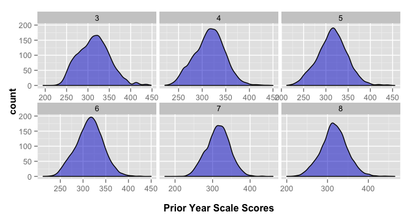

##### `r figCapNo("Marginal distributions of current scale scores:  Reading.")`
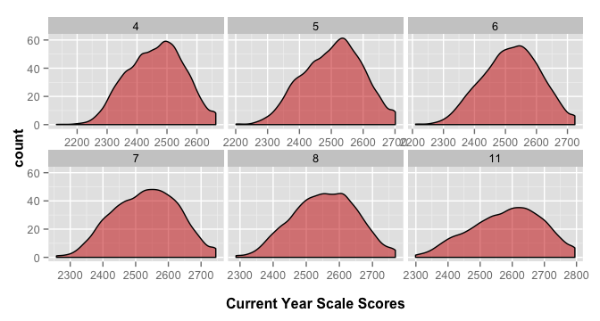

<!-- LaTeX_Start 
\begin{figure}[H]
\caption*{\label{fig:Bidensity} {\bf{Fig. C.1:}} Marginal distributions of prior scale scores:  Reading.}
  \begin{subfigure}[b]{\textwidth}
    \includegraphics[width=\textwidth]{../img/Appendices/Appendix_C_2015/margDist_Prior_Reading-1.png}
  \end{subfigure}
\end{figure}

\begin{figure}[H]
\caption*{\label{fig:Bidensity} {\bf{Fig. C.2:}} Marginal distributions of current scale scores:  Reading.}
  \begin{subfigure}[b]{\textwidth}
    \includegraphics[width=\textwidth]{../img/Appendices/Appendix_C_2015/margDist_Crnt_Reading-1.png}
  \end{subfigure}
\end{figure}

\pagebreak
LaTeX_End -->


###  Mathematics

<!-- HTML_Start -->
##### `r figCapNo("Marginal distributions of prior scale scores:  Mathematics.")`
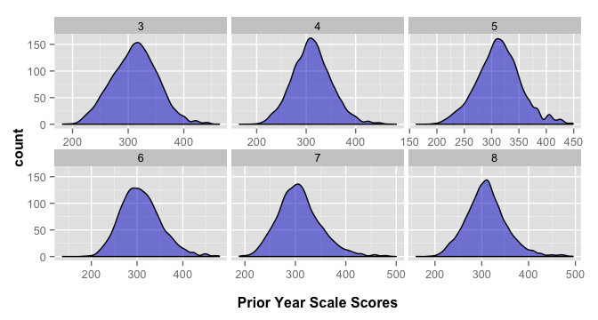

##### `r figCapNo("Marginal distributions of current scale scores:  Mathematics.")`
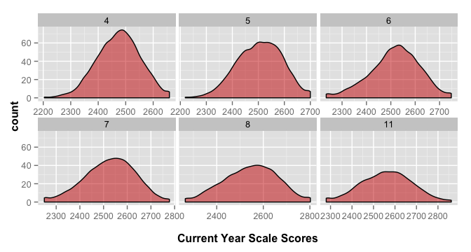

<!-- LaTeX_Start 
\begin{figure}[H]
\caption*{\label{fig:Bidensity} {\bf{Fig. C.3:}} Marginal distributions of prior scale scores:  Mathematics.}
  \begin{subfigure}[b]{\textwidth}
    \includegraphics[width=\textwidth]{../img/Appendices/Appendix_C_2015/margDist_Prior-1.png}
  \end{subfigure}
\end{figure}

\begin{figure}[H]
\caption*{\label{fig:Bidensity} {\bf{Fig. C.4:}} Marginal distributions of current scale scores:  Mathematics.}
  \begin{subfigure}[b]{\textwidth}
    \includegraphics[width=\textwidth]{../img/Appendices/Appendix_C_2015/margDist_Crnt-1.png}
  \end{subfigure}
\end{figure}

\pagebreak
LaTeX_End -->

## Conditional Distributions

The marginal density plots provide a limited amount of information, particularly for the potential for ceiling/floor effects in the calculation of ***growth***.  In order to provide a more nuanced view of the relationship between the prior and current scale scores, the following plots depict the conditional (joint) distributions for each content area and grade level.  These plots start with a basic scatter plot of each student's scores, and on top of this is layered 1) **green contour lines** to provide a sense of joint density, 2) a **magenta non-linear line** identifying the bivariate relationship between prior and current scores, and 3) **rug plots** that describe the marginal distributions (as above, the prior scores are blue and current scores are red).  

For the 2014 and 2015 Hawaii data, we again see cause for concern for ceiling effects in nearly all content area and grade combinations.  Additionally, we also see some concern for floor effects in the middle-grade Mathematics analyses.  These effects present themselves as dark shaded points in the extreme top-right or bottom-left corners of the plots.  This suggests that staying at the extremes from year to year is not uncommon, which may lead to odd growth estimates for these chronically high/low achieving students.  The 6<sup>th</sup> to 8<sup>th</sup> Grade Mathematics plots in Figure C.8 shows indications consistent with both ceiling and floor effects.


```{r, echo=FALSE, include=FALSE, condDist_EOGT, cache=TRUE, fig.height=3, fig.width=3}
#  Loop around subjects to produce plots:
	condDistPlot(ca="READING", g=4)
	condDistPlot(ca="READING", g=5)
	condDistPlot(ca="READING", g=6)
	condDistPlot(ca="READING", g=7)
	condDistPlot(ca="READING", g=8)
	condDistPlot(ca="READING", g=11)

	condDistPlot(ca="MATHEMATICS", g=4)
	condDistPlot(ca="MATHEMATICS", g=5)
	condDistPlot(ca="MATHEMATICS", g=6)
	condDistPlot(ca="MATHEMATICS", g=7)
	condDistPlot(ca="MATHEMATICS", g=8)
	condDistPlot(ca="MATHEMATICS", g=11)
	
# for (ca in GL_subjects) {
# 	for (g in 4:11) {
# 		x <- data.table(long.data[YEAR==current.year & CONTENT_AREA==ca & GRADE==g,][, list(ID, SCALE_SCORE, SCALE_SCORE_PRIOR)][!is.na(SCALE_SCORE_PRIOR)], key=c("ID", "SCALE_SCORE"))
# 		if (dim(x)[1] > 0) {
# 			condDistPlot(data=x, ca, g)
# 		}
# 	}
# }
```

###  Mathematics

<!-- HTML_Start -->
##### `r figCapNo("Conditional distribution(s) of current and prior scale scores:  Mathematics.")`
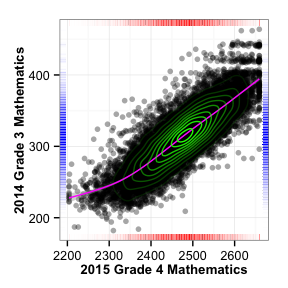 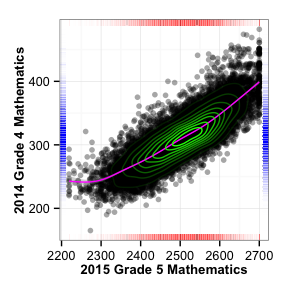 


##### `r figCapNo("Conditional distribution(s) of current and prior scale scores:  Mathematics <em>Continued</em>.")`
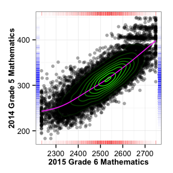 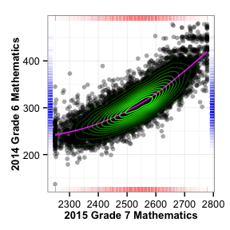 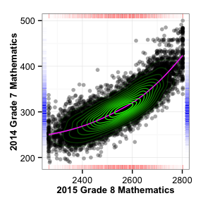 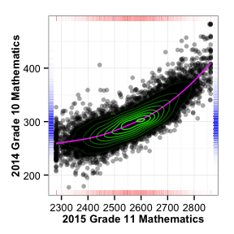

<!-- LaTeX_Start 
\begin{figure}[H]
\caption*{\label{fig:condDistMath} {\bf{Fig. C.7:}} Conditional distribution(s) of current and prior scale scores:  Mathematics.}
  \begin{subfigure}[b]{0.5\textwidth}
    \includegraphics[width=\textwidth]{../img/Appendices/Appendix_C_2015/condDist_EOGT-7.png}
  \end{subfigure}
  \begin{subfigure}[b]{0.5\textwidth}
    \includegraphics[width=\textwidth]{../img/Appendices/Appendix_C_2015/condDist_EOGT-8.png}
  \end{subfigure}
\end{figure}

\pagebreak

\begin{figure}[H]
\caption*{\label{fig:condDistMath2} {\bf{Fig. C.8:}} Conditional distribution(s) of current and prior scale scores:  Mathematics \textit{Continued}.}
  \begin{subfigure}[b]{0.5\textwidth}
    \includegraphics[width=\textwidth]{../img/Appendices/Appendix_C_2015/condDist_EOGT-9.png}
  \end{subfigure}
  \begin{subfigure}[b]{0.5\textwidth}
    \includegraphics[width=\textwidth]{../img/Appendices/Appendix_C_2015/condDist_EOGT-10.png}
  \end{subfigure}
  \begin{subfigure}[b]{0.5\textwidth}
    \includegraphics[width=\textwidth]{../img/Appendices/Appendix_C_2015/condDist_EOGT-11.png}
  \end{subfigure}
  \begin{subfigure}[b]{0.5\textwidth}
    \includegraphics[width=\textwidth]{../img/Appendices/Appendix_C_2015/condDist_EOGT-12.png}
  \end{subfigure}
\end{figure}

\pagebreak
LaTeX_End -->

###  Reading

<!-- HTML_Start -->
##### `r figCapNo("Conditional distribution(s) of current and prior scale scores:  Reading.")`
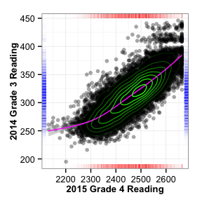 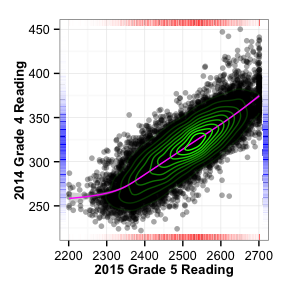


##### `r figCapNo("Conditional distribution(s) of current and prior scale scores:  Reading <em>Continued</em>.")`
 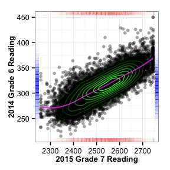 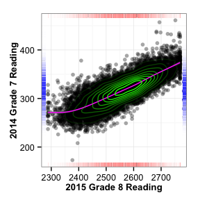 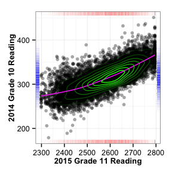 


<!-- LaTeX_Start 
\begin{figure}[H]
\caption*{\label{fig:condDistReading} {\bf{Fig. C.9:}} Conditional distribution(s) of current and prior scale scores:  Reading.}
  \begin{subfigure}[b]{0.5\textwidth}
    \includegraphics[width=\textwidth]{../img/Appendices/Appendix_C_2015/condDist_EOGT-1.png}
  \end{subfigure}
  \begin{subfigure}[b]{0.5\textwidth}
    \includegraphics[width=\textwidth]{../img/Appendices/Appendix_C_2015/condDist_EOGT-2.png}
  \end{subfigure}
  %
  \begin{subfigure}[b]{0.5\textwidth}
    \includegraphics[width=\textwidth]{../img/Appendices/Appendix_C_2015/condDist_EOGT-3.png}
  \end{subfigure}
  \begin{subfigure}[b]{0.5\textwidth}
    \includegraphics[width=\textwidth]{../img/Appendices/Appendix_C_2015/condDist_EOGT-4.png}
  \end{subfigure}
\end{figure}

\pagebreak

\begin{figure}[H]
\caption*{\label{fig:condDistReading2} {\bf{Fig. C.10:}} Conditional distribution(s) of current and prior scale scores:  Reading \textit{Continued}.}
  \begin{subfigure}[b]{0.5\textwidth}
    \includegraphics[width=\textwidth]{../img/Appendices/Appendix_C_2015/condDist_EOGT-5.png}
  \end{subfigure}
  \begin{subfigure}[b]{0.5\textwidth}
    \includegraphics[width=\textwidth]{../img/Appendices/Appendix_C_2015/condDist_EOGT-6.png}
  \end{subfigure}
\end{figure}

\pagebreak
LaTeX_End -->

# SGP Ranges for the Highest and Lowest Achieving Students

In order to isolate the impact of assessment ceilings/floors on student growth percentile (SGP) calculations, the following section provides box plots of the distribution of SGPs for the highest and lowest achieving students.  We are specifically interested in the SGPs for students scoring at the highest/lowest obtainable scale score (HOSS/LOSS - i.e. the actual ceiling/floor).  However, in order to assure that an adequate number of students are included in these plots, the first set of plots in each subsection uses, at a *minimum*, the highest/lowest 50 scores.  Note that this roughly corresponds to the number of students used in the SGP model goodness of fit plots, and this is why these plots are provided as a starting point for this part of the investigation.  If all 50 students have only a single scale score value (i.e. the HOSS/LOSS), then **all** students with this score are included.  Consequently, the number of students included in each box plot may be greater than 50 (the exact number is shown at the margins in red text).

The second set of box plots isolate ***only*** those students scoring the HOSS/LOSS.  These plots may then incorporate a varying number of students depending on the prevalence of a ceiling/floor in the current year test scores.

The box plots provide several descriptive statistics.  The dark line within the box marks the *median* SGP, while the ends ("hinges") of the boxes correspond to the first and third quartiles (the 25<sup>th</sup> and 75<sup>th</sup> percentiles).  The upper whisker extends from the hinge to the highest value that is within 1.5 $\times$ IQR of the hinge, where IQR is the inter-quartile range, or distance between the first and third quartiles. The lower whisker extends from the hinge to the lowest value within 1.5 $\times$ IQR of the hinge. Data beyond the end of the whiskers are outliers and plotted as points.  Evidence of a *lack* of either a ceiling or floor effect would be to have all high achieving students with SGPs near 99 and all low achieving students with SGPs near 1.  That is, the desired visual evidence is a solid line at SGP = 99/1.

In the 2015 Hawaii SGP analyses, we see ceiling effects in all grades and subjects.  There is also evidence of floor effects in the middle-grade mathematics analyses as well.

```{r, echo=FALSE, include=FALSE, cache=TRUE, HOSS_Box_EOGT, fig.height=4, fig.width=7}
	min.ceiling<-min(max.data[CONTENT_AREA %in% GL_subjects]$SGP) -5
	boxPlot(tmp.data=max.data[CONTENT_AREA %in% GL_subjects], min.ceiling)
	boxPlot(tmp.data=max.data[CONTENT_AREA %in% GL_subjects & SCALE_SCORE==HOSS_1], min.ceiling)
```

```{r, echo=FALSE, include=FALSE, cache=TRUE, LOSS_Box_EOGT, fig.height=4, fig.width=7}
	max.floor <- max(min.data[CONTENT_AREA %in% GL_subjects]$SGP)
	boxPlot(tmp.data=min.data[CONTENT_AREA %in% GL_subjects], max.floor +5, LOSS=TRUE)
	boxPlot(tmp.data=min.data[CONTENT_AREA %in% GL_subjects & SCALE_SCORE==LOSS_1], max.floor, LOSS=TRUE)
```

<!-- HTML_Start -->
##### `r figCapNo("SGP distributions for highest and lowest 0.5% of scale scores by content area and grade level.")`
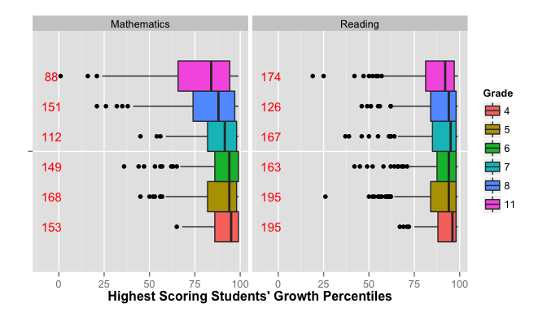


##### `r figCapNo("SGP distributions for the HOSS and LOSS scores by content area and grade level.")`
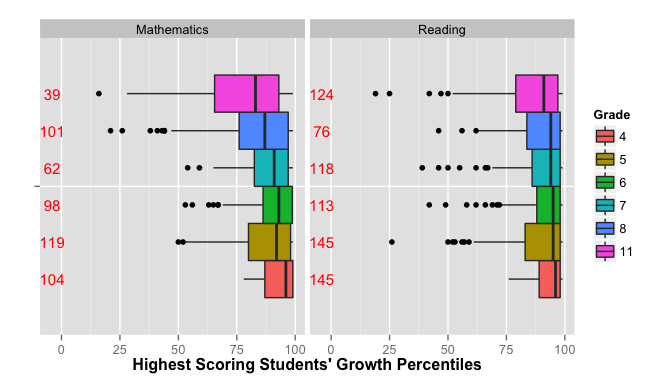

<!-- LaTeX_Start 
\begin{figure}[H]
\caption*{\label{fig:boxPlotEOGT} {\bf{Fig. C.14:}} SGP distributions for highest and lowest 0.5 percent of scale scores by content area and grade level.}
  \begin{subfigure}[b]{\textwidth}
    \includegraphics[width=\textwidth]{../img/Appendices/Appendix_C_2015/HOSS_Box_EOGT-1.png}
  \end{subfigure}
  \begin{subfigure}[b]{\textwidth}
    \includegraphics[width=\textwidth]{../img/Appendices/Appendix_C_2015/LOSS_Box_EOGT-1.png}
  \end{subfigure}
\end{figure}

\begin{figure}[H]
\caption*{\label{fig:boxPlotEOGT2} {\bf{Fig. C.15:}} SGP distributions for the HOSS and LOSS scores by content area and grade level.}
  \begin{subfigure}[b]{\textwidth}
    \includegraphics[width=\textwidth]{../img/Appendices/Appendix_C_2015/HOSS_Box_EOGT-2.png}
  \end{subfigure}
  \begin{subfigure}[b]{\textwidth}
    \includegraphics[width=\textwidth]{../img/Appendices/Appendix_C_2015/LOSS_Box_EOGT-2.png}
  \end{subfigure}
\end{figure}

\pagebreak
LaTeX_End -->


#  Discussion

Overall there is evidence of ceiling effects in the 2015 Hawaii SGP analyses in both Mathematics and Reading across all grades.  There is also evidence of more minor floor effects in the middle-grade Mathematics analyses.  When ceiling or floor effects are encountered, there are several ways in which they can be "corrected" manually or analytically.  These include (but not limited to):

1. Convert all students scoring at the HOSS (LOSS) to 99 (1).
2. Run SGP analyses with more granular scores.  For example, many tests that use Item Response Theory (IRT) to analyse test results provide scaled scores that enforce an artificial ceiling (floor), but also have more granular achievement scores available (IRT $\theta$ estimates).
3. Leave the results without a correction.

