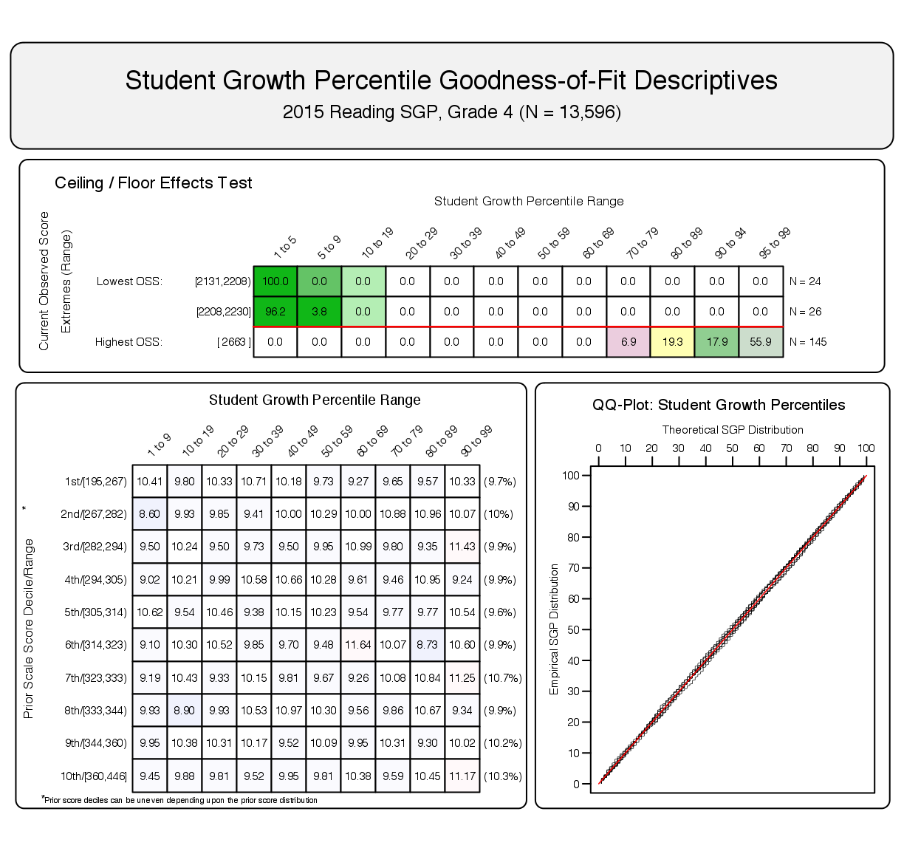
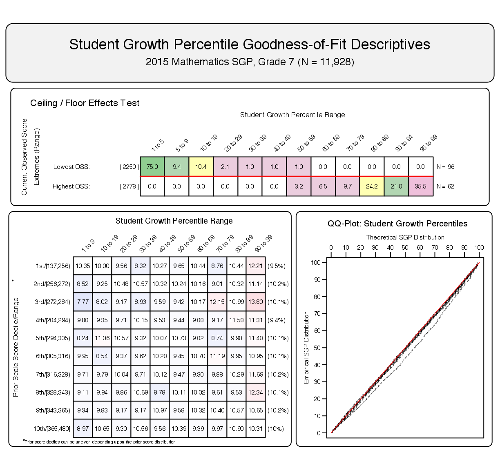

<!--SGPreport-->


<!-- 
This document was written by Damian Betebenner & Adam VanIwaarden for the Hawaii State Office of Education (HIDOE).

	Original Draft:  November 30, 2015
	...
-->

<!-- load some R packages and functions required for HTML table creation silently.  Load SGP and other packages here to avoid messages. -->

```{r, echo=FALSE, include=FALSE}
  ## set a universal Cache path
  knitr::opts_chunk$set(cache.path = "_cache/HI_SGP_2015")

  ##  Load some R packages and functions required for HTML table creation silently.  
  ##  Load SGP and other packages here to avoid messages.
  require(SGP)
	require(data.table)
	require(plyr)
	require(Gmisc)
  require(htmlTable)
  require(ztable)

  options(table_counter=FALSE)
  options(table_number=0)
  options("fig_caption_no"=0)
	options(fig_caption_no_sprintf = "**Figure %s:**   %s")
	options("fig_caption_no_roman"=FALSE)
	options("equation_counter" = 0)
																												
	GL_subjects <- c("MATHEMATICS", "READING")
	EOCT_subjects <- NULL
```

# Introduction
This report contains details on the implementation of the student growth percentiles (SGP) model for the state of Hawaii. The National Center for the Improvement of Educational Assessment (NCIEA) contracted with the Hawaii State Office of Education (HIDOE) to implement the SGP methodology using data derived from the Smarter Balanced Assessment ([SBA](http://www.smarterbalanced.org/)) program to create the Hawaii Student Growth Model. The goal of the engagement with HIDOE is to create a set of open source analytic techniques and conduct a set of initial analyses that will eventually be conducted by HIDOE in following years.

The SGP methodology is an open source norm- and criterion-referenced student growth analysis that produces student growth percentiles and student growth projections/targets for each student with longitudinal data in the state. The methodology is currently used for many purposes. States and districts have used the results in various ways including parent/student diagnostic reporting, institutional improvement, and school and educator accountability. 

The report includes four sections covering Data, Analytics, SGP Results, and Goodness of Fit:

- *Data* includes details on the decision rules used in the raw data preparation and student record validation.
- *Analytics* introduces some of the basic methodological concepts implemented.
- *SGP Results* provides basic descriptive statistics from the 2015 analyses.
- *Goodness of Fit* describes how well the statistical models used to produce SGPs fit Hawaii students' data.  This includes discussion of goodness of fit plots and the student- and school level correlations between SGP and prior achievement.

Additionally, multiple appendices are included.  Appendix A includes Goodness of Fit plots for all content areas and grades.  Appendix B provides a more technical description of the SGP methodology and statistical concepts.  Appendix C is a more detailed investigation of potential ceiling and/or floor effects present in Hawaii's student assessments and growth analyses.

<!-- HTML_Start -->
<!-- LaTeX_Start 
\pagebreak
LaTeX_End -->

# Data
Data for the Hawaii Smarter Balanced Assessment (SBA) were supplied by the Hawaii SOE to the NCIEA for analysis in late summer 2015 for use in the SGP analyses. The current longitudinal data set now includes academic years 2007-2008 through 2014-2015. Subsequent years' analyses will augment this multi-year data set allowing HIDOE to maintain a comprehensive longitudinal data set for all students taking the SBA assessments.

Student Growth Percentiles have been produced for students that have a current score and at least one prior score in Mathematics or Reading tests. 

## Longitudinal Data
Growth analyses on assessment data require data which are linked to individual students over time.  Student growth percentile analyses require, at a minimum, two years of assessment data for analysis of student progress.  To this end it is necessary that a unique student identifier be available so that student data records across years can be merged with one another and subsequently examined. Because some records in the assessment data set contain students with more than one test score in a content area in a given year, a process to create unique student records in each content area by year combination is required in order to carry out subsequent growth analyses.  All valid case selection business rules were implimented by HIDOE prior to submission of the 2015 student level data.

Table `r tblNumNext()` shows the number of valid grade level student records available for analysis^[This number does not represent the number of SGPs produced, however, because students are required to have at least one prior score available as well.].

```{r, results='asis', echo=FALSE, N_table}
	n_tbl <- table(Hawaii_SGP@Data[YEAR=='2015' & VALID_CASE=='VALID_CASE']$CONTENT_AREA, Hawaii_SGP@Data[YEAR=='2015' & VALID_CASE=='VALID_CASE']$GRADE)
	n_tbl <- cbind('Content Area'=sapply(GL_subjects, capwords, special.words=c("ELA")), n_tbl)
	n_tbl <- prettyNum(n_tbl, preserve.width = "individual",big.mark=',')
	n_tbl[which(n_tbl==0)] <- ''
	n_tbl <- n_tbl[, match(c('Content Area', sort(as.numeric(colnames(n_tbl)[-1]))), colnames(n_tbl))]
	row.names(n_tbl) <- NULL

  cat(dualTable(as.matrix(n_tbl), align=paste(rep('r', dim(n_tbl)[2]), collapse=''), 
		n.cgroup=c(1, dim(n_tbl)[2]-1), cgroup=c("", "Grades"),
		caption='Number of Valid Grade Level Student Records by Grade and Subject for 2015'))
```

<!-- HTML_Start -->
<!-- LaTeX_Start 
\pagebreak
LaTeX_End -->

# Analytics

This section provides basic details about the calculation of student growth percentiles and percentile growth trajectories ('projections') from Hawaii SBA data using the [`R` Software Environment](http://www.r-project.org/) [@Rsoftware] in conjunction with the [`SGP` Package](https://github.com/CenterForAssessment/SGP) [@sgp2015].  More in depth treatment of the data analysis process with code examples is available to HIDOE the staff through Github.

Broadly, the SGP analysis of the Hawaii longitudinal student assessment data takes place in two steps:

1. Data Preparation
2. Data Analysis

Those familiar with data analysis know that the bulk of the effort in the above two step process lies with Step 1: Data Preparation.  Following thorough data cleaning and preparation, data analysis using the `SGP` Package takes clean data and makes it as easy as possible to calculate, summarize, output and visualize the results from SGP analyses.

## Data Preparation

The data preparation step involves taking data provided by the HIDOE and producing a `.Rdata` file that will subsequently be analyzed in Step 2. This process is carried out annually as new data becomes available from the state assessment program.  The data supplied by the HIDOE Information Technology department and subsequently cleaned and processed using `R`.

In previous years' analyses the bulk of the data cleaning and implementation of business rule validation was also performed in `R` by NCIEA staff.  However, the division of the cleaning and validation tasks used in 2015 is an important step in moving towards HIDOE self-sufficiency in calculating growth percentiles in subsequent years.

The cleaned and formatted data was combined with the existing data used up through the 2014 analyses.  With an appropriate longitudinal data prepared, we continued to the calculation of student-level SGPs.

## 2015 Data Analysis

The objective of the student growth percentile (SGP) analysis is to produce a measure which describes how (a)typical a student's growth is by examining his/her current achievement relative to students with a similar achievement history; i.e. his/her *academic peers*. The estimation of this norm-referenced growth quantity is conducted using quantile regression [@Koenker:2005] to model curvilinear functional relationships between student's prior and current scores.  One hundred such regression calculations are run for each separate analysis (defined as a unique year, content area, and grade combination).  The end product of these 100 separate regression models is a single coefficient matrix, which serves as a look-up table to relate prior student achievement to current achievement for each percentile. This process ultimately leads to the calculation of thousands of calculations for each of Hawaii's annual analyses.  For a more in-depth discussion of the calculation and estimation of SGPs, see Betebenner ([-@Betebenner:2009]) and Appendix B of this report for further information on the SGP methodology.

The 2015 Hawaii SGP analyses follow a work flow established in previous years that includes the following three steps:

1. Update the `SGPstateData` object in the `SGP` package.  For 2015 this included ***a)*** adding meta-data used in the calculation of student growth percentiles and projections, including the SBA test knots and boundaries for the cubic basis splines and the test specific proficiency cutscores, and ***b)*** adding new SBA related meta-data for the production of individual student reports (ISRs).
2. Conduct SGP Analyses.
3. Export data, and produce summaries and visualizations from the `Hawaii_SGP` data object (including ISRs).


### Update Hawaii assessment meta-data
The use of higher-level functions included in the SGP package (e.g. `analyzeSGP`) requires the availability of state specific assessment information.  This meta-data is compiled in a `R` object named `SGPstateData` that is housed in the package.  The required updates for the 2015 analyses included ***a)*** adding meta-data used in the calculation of student growth percentiles and projections, including the SBA test knots and boundaries for the cubic basis splines and the test specific proficiency cutscores, and ***b)*** adding new SBA related meta-data for the production of individual student reports (ISRs).

<div class='caption'>**Calculation and addition of knots and boundaries**</div>
Calculation of SGPs includes the use of cubic B-spline basis functions to more adequately model the heteroscedasticity and non-linearity found in assessment data.^[It should be noted that the independent estimation of the regression functions can potentially result in the crossing of the quantile functions.  This occurs near the extremes of the distributions and is potentially more likely to occur given the use of non-linear functions.  A potential result of allowing the quantile functions to cross would be *lower* percentile estimations of growth for *higher* observed scale scores at the extremes (give all else equal in students' prior score histories) and vice versa.  In order to deal with these contradictory estimates, quantile regression results are isotonized to prevent quantile crossing following the methods derived by Chernozhukov, Fernandez-Val and Glichon [-@chernozhukov2010quantile].]  These functions require the selection of boundary and interior knots.  Boundary knots are end-points outside of the scale score distribution that anchor the B-spline basis.  These are generally selected by extending the entire range of scale scores by 10%.  That is, they are defined as lying 10% below the lowest obtainable (or observed) scale score (LOSS) and 10% above the highest obtainable scale score (HOSS).  The interior knots are the *internal* breakpoints that define the spline.  The default choice in the `SGP` package [@sgp2015] is to select the 20<sup>th</sup>, 40<sup>th</sup>, 60<sup>th</sup> and 80<sup>th</sup> quantiles of the observed scale score distribution.

In general the knots and boundaries are computed from a distribution comprised of several years of test data (i.e. multiple cohorts) so that any irregularities in a single year are smoothed out.  This is important because subsequent annual analyses use these same knots and boundaries as well.  All defaults were used to compile the knots and boundaries for Hawaii State Assessment (HSA) in previous years, and were also used in 2015 to compute the SBA assessments' knots and boundaries using SBA data from Hawaii and other SBA Consortium states.  These new knots and boundaries were used in 2015 as part of the equated student growth projections, and will be required for Hawaii SBA assessments beginning in 2016 as they are now used as the dependent variables in the quantile regressions.


<div class='caption'>**SBA proficiency level cutscores**</div>
Cutscores, which are set externally by the SBA Consortium through standard-setting processes, are mainly required for student growth projections. These growth projection estimates are used in the computation of adequate growth measures and elements of the ISRs.  The SBA cutscore data was added to the `SGPstateData` by the Center for Assessment.


<div class='caption'>**ISR meta-data**</div>
Finally, meta data for the ISR production was added.  Mainly this entailed updating the `Assessment_Program_Information` and `Student_Report_Information` sections.  The entire 2015 Hawaii entry of the `SGPstateData` can be [viewed here.](https://github.com/CenterForAssessment/SGPstateData/blob/375e243e6319022f10c70df8dd01c293b5c39f00/SGPstateData.R#L1719)


### Conduct SGP Analyses.

As in previous years, we use the `updateSGP` function to A) do the final preparation and addition of the new long data to the existing `SGP` data object (`prepareSGP` step) and B) produce SGPs for ELA/Reading^[Note that the official name of the SBA assessment is "English Language Arts/Literacy" (ELA), but is refered to here as "Reading" to maintain consistency with the HSA assessments.] and Mathematics (`analyzeSGP` step).


Running this analysis will internally run the six steps of a typical SGP analysis, including the following:

1. [`prepareSGP`](https://github.com/CenterForAssessment/SGP/blob/master/R/prepareSGP.R) Combines the 2015 LONG data file with the existing longitudinal LONG file in *Hawaii_SGP@Data* and run checks associated with `prepareSGP` on merge result.
2. [`analyzeSGP`](https://github.com/CenterForAssessment/SGP/blob/master/R/analyzeSGP.R) Performs 2015 SGP analyses including student growth percentiles, student growth projections, and lagged student growth projections. 
3. [`combineSGP`](https://github.com/CenterForAssessment/SGP/blob/master/R/combineSGP.R) Merges results from 2015 analyses back into the master longitudinal record, *Hawaii_SGP@Data*, and calculates/creates scale scores associated with SGP targets.
4. [`summarizeSGP`](https://github.com/CenterForAssessment/SGP/blob/master/R/summarizeSGP.R) Saves previous summaries to hard disk, *Hawaii_SGP@Summary*, as *Hawaii_SGP_Summary_2012.Rdata* and calculates new summaries for the current year.
5. [`visualizeSGP`](https://github.com/CenterForAssessment/SGP/blob/master/R/visualizeSGP.R) Creates state level summary bubble plots, growth achievement plots (wave charts), and demonstration student growth plots.
6. [`outputSGP`](https://github.com/CenterForAssessment/SGP/blob/master/R/outputSGP.R) Exports data in multiple formats: 
  * *Hawaii_SGP_Data_LONG.txt.zip* a pipe delimited copy of *Hawaii_SGP@Data*, the complete master longitudinal record.
  * *Hawaii_SGP_Data_LONG_2015.txt.zip* a pipe delimited copy of the 2015 longitudinal record subsetted from *Hawaii_SGP@Data*.
  * *Hawaii_SGPData_WIDE.txt.zip* a pipe delimited WIDE version of the master longitudinal record, *Hawaii_SGP@Data*.
  * *Hawaii_SGP_INSTRUCTOR_Data.txt.zip* a pipe delimited LONG version of the INSTRUCTOR_NUMBER file merged with the master longitudinal data record.

<!-- HTML_Start -->
<!-- LaTeX_Start 
\pagebreak
LaTeX_End -->


# SGP Results
The following sections provide basic descriptive statistics from the 2015 analyses, including the state level mean and median growth percentiles.  Currently Hawaii uses cohort referenced SGPs as the official student level growth metric.  The interested reader can find more in depth discussions of the SGP methodology in Appendix B of this report.

## Median SGPs
Growth percentiles, being quantities associated with each individual student, can be easily summarized across numerous grouping indicators to provide summary results regarding growth.  The median and mean of a collection of growth percentiles are used as measures of central tendency that summarize the distribution as a single number.  With perfect data fit, we expect the state median of all student growth percentiles in any grade to be 50 because the data are norm-referenced across all students in the state.  Median (and mean) growth percentiles well below 50 represent growth less than the state "average" and median growth percentiles well above 50 represent growth in excess of the state "average".

To demonstrate the norm-referenced nature of the growth percentiles viewed at the state level, Table `r tblNumNext()` presents the cohort-referenced growth percentile medians and means by grade and content area.

```{r, cache=TRUE, echo=FALSE, include=FALSE}
	gl_smry <- Hawaii_SGP@Data[CONTENT_AREA %in% GL_subjects & YEAR=='2015'][, list(MEDIAN = median(as.numeric(SGP), na.rm=TRUE), MEAN = round(mean(SGP, na.rm=TRUE), 1)), keyby=list(CONTENT_AREA, GRADE)][!is.na(MEDIAN)]
	gl_smry [, GRADE := as.numeric(GRADE)]
	setkey(gl_smry)
```
```{r, results='asis', echo=FALSE, sumTab_GL}
	gl_smryB <- data.frame()
	for (ca in GL_subjects){
		tmp_gl_smry <- paste(t(as.matrix(gl_smry[CONTENT_AREA==ca,][, list(MEDIAN)])), " (", t(as.matrix(gl_smry[CONTENT_AREA==ca,][, list(MEAN)])), ")", sep="")
		tmp_gl_smry <- data.frame(matrix(c(capwords(ca), tmp_gl_smry), 1, length(tmp_gl_smry)+1), stringsAsFactors = FALSE)
		names(tmp_gl_smry) <- c("Content Area", t(as.matrix(gl_smry[CONTENT_AREA==ca,][, list(GRADE)])))
		gl_smryB <- rbind.fill(gl_smryB, tmp_gl_smry)
	}
	gl_smryB[is.na(gl_smryB)] <- ""
	
  cat(dualTable(as.matrix(gl_smryB), title="", align=paste(rep('r', dim(gl_smryB)[2]), collapse=''), 
  	n.cgroup=c(1, dim(gl_smryB)[2]-1), cgroup=c("", "Grades"),
		caption='Grade Level SBA Median (Mean) Student Growth Percentile by Grade and Content Area for 2015'))
```

Based upon perfect model fit to the data, the median of all state growth percentiles in each grade by year by subject combination should be 50.  That is, in the conditional distributions, 50 percent of growth percentiles should be less than 50 and 50 percent should be greater than 50.  Deviations from 50 indicate imperfect model fit to the data.  Imperfect model fit can occur for a number of reasons, some due to issues with the data (e.g., floor and ceiling effects leading to a "bunching" up of the data) as well as issues due to the way that the SGP function fits the data.  The results in Table `r tblNum()-1` are close to perfect, with almost all values equal to 50. XXX 6th grade Math??? XXX

The results are coarse in that they are aggregated across tens of thousands of students. More refined fit analyses are presented in the Goodness-of-Fit section that follows. Depending upon feedback from Hawaii SOE, it may be desirable to tweak with some operational parameters and attempt to improve fit even further. The impact upon the operational results based on better fit is expected to be extremely minor.

It is important to note how, at the entire state level, the *norm-referenced* growth information returns little information on annual trends due to its norm-reference nature. What the results indicate is that a typical (or average) student in the state demonstrates 50<sup>th</sup> percentile growth. That is, "typical students" demonstrate "typical growth". One benefit of the norm-referenced results follows when subgroups are examined (e.g., schools, district, demographic groups, etc.) Examining subgroups in terms of the median of their student growth percentiles, it is then possible to investigate why some subgroups display lower/higher student growth than others. Moreover, because the subgroup summary statistic (i.e., the median) is composed of many individual student growth percentiles, one can break out the result and further examine the distribution of individual results. 


<!-- HTML_Start -->
<!-- LaTeX_Start 
\pagebreak
LaTeX_End -->

# Goodness of Fit
Examination of goodness-of-fit was conducted by comparing the estimated conditional density with the theoretical uniform density of the SGPs.  Despite the use of B-splines to accommodate heteroscedasticity and skewness of the conditional density, assumptions are made concerning the number and position of spline knots that impact the percentile curves that are fit.  With an infinite population of test takers, at each prior scaled score, with perfect model fit, the expectation is to have 10 percent of the estimated growth percentiles between 1 and 9, 10 and 19, 20 and 29, ..., and 90 and 99.  Deviations from 10 percent would be indicative of lack of model fit.  


## Model Fit Plots
Using all available test scores as the variables, estimation of student growth percentiles was conducted for each possible student (those with a current score and at least one prior score).  A goodness of fit plot is produced for each unique analysis run in 2015.  Each analysis is defined by the grade and content area for the grade-level analyses.

The "Ceiling/Floor Effects Test" panel is intended to help identify potential problems in SGP estimation at the Highest and Lowest Obtainable (or Observed) Scale Scores (HOSS and LOSS).  If is is relatively typical for extremely high (low) achieving students to consistently score at or near the HOSS (LOSS) each year, the SGPs for these students may be unexpectedly low (high).  That is, for example, if a sufficient number of students maintain performance at the HOSS over time, this performance will be estimated to typical, and therfore SGP estimates will reflect typical growth (e.g. 50th percentile).  In some cases small deviations from these extreme score values might even yield low growth estimates.  Although these score patterns can ligitimately be estimated as a low growth percentile, it is potentially an unfair description of student growth (and by proxy teacher or school, etc. performance or "value added").  Ultimately this is an artifact of the inability of the assessment to adequately measure student performance at extreme ability levels.  

The table of values here shows whether the current year scale scores at both extremes yield the expected SGPs^[Note that the prior year scale scores are not represented here, but are critical in the SGP calculation of all students].  The expectation is that the majority of SGPs for students scoring at or near the LOSS will be low (preferably less than 5 and not higher than 10), and that SGPs for students scoring at or near the HOSS will be high (preferably higher than 95 and not less than 90).  Because few students may  score *exactly* at the HOSS/LOSS^[This is particularly true when IRT Theta ($\hat{\theta}$) estimates are used rather than scaled scores, which often apply artificial LOSS/HOSS cut points.], the top/bottom 50 students are selected and any student scoring within their range of scores are selected for inclusion in these tables.  Consequently, there may be a range of scores at the HOSS/LOSS rather than a single score^[This can make the interpretation of the SGP distribution somewhat harder because current year scores not directly at the extremes do not necessarily preclude maximum SGP estimates.], and there may be more than 50 students included in the HOSS/LOSS row if the 50 students at the extremes only contain the single HOSS/LOSS score^[This also leads to potential difficulties in interpretation because with a higher number of students comes a greater distribution of prior scale scores and therefore a greater distribution of the expected SGPs].  In either case, a more fine grained analysis of the relationship between score histories and SGPs and the associated potential for ceiling or floor effects in the models/model estimates may be necessary.  These plots are meant to serve more as a "canary in the coal mine" than as a detailed, conclusive indicator of an effect.

The bottom left panel shows the empirical distribution of SGPs given prior scale score deciles in the form of a 10 by 10 cell grid.  Percentages of student growth percentiles between the 10<sup>th</sup>, 20<sup>th</sup>, 30<sup>th</sup>, 40<sup>th</sup>, 50<sup>th</sup>, 60<sup>th</sup>, 70<sup>th</sup>, 80<sup>th</sup>, and 90<sup>th</sup> percentiles were calculated based upon the empirical decile of the cohort's prior year scaled score distribution^[The total students in each for the analyses varies depending on grade and subject.].  Deviations from perfect fit are indicated by red and blue shading. The further above 10 the darker the red, and the further below 10 the darker the blue. A more detailed discussion about the reasons for and implications of model misfit for the various SGP analysis types can be found in the "Goodness of Fit" section of the 2015 Hawaii Student Growth Model report.  

The bottom right panel of each plot is a Q-Q plot which compares the observed distribution of SGPs with the theoretical (uniform) distribution.  An ideal plot here will show black step function lines that do not deviate greatly from the ideal, red line which traces the 45 degree angle of perfect fit.

As an example, Figure `r getOption("fig_caption_no")+1` shows the results for 4<sup>th</sup> grade ELA/Reading as an example of good model fit.  The model fit also appears to be excellent in terms of lack of floor effects, although there is some evidence of a minor ceiling effect despite all other indicators suggesting good model fit.  Figure `r getOption("fig_caption_no")+2` is the fit plot for 7<sup>th</sup> grade Mathematics, and demonstrates minor model misfit and evidence of both ceiling and floor effects.

```{r, cache=TRUE, echo=FALSE, include=FALSE, GOFplots}
  ##    Create goodness of fit plots for tech report example
	dir.create("../img", recursive=TRUE, showWarnings=FALSE)

  setwd("../img")

	### ELA Grade 4 as example of GOOD fit ...
  ##  Choice of 4th grade and Reading are arbitrary ...
  ##  Keep using that from year to year to show it IS arbitrary - no need to change year to year ... ...
  
  dat <- data.table(Hawaii_SGP@SGP[['SGPercentiles']][['READING.2015']])
	dat <- dat[grep("2015/READING_4", SGP_NORM_GROUP),]
	dat[, VALID_CASE := 'VALID_CASE']
	dat[, GRADE := '4']
	dat[, YEAR := '2015']
	dat[, CONTENT_AREA := "READING"]
	setkeyv(dat, c("VALID_CASE", "CONTENT_AREA", "YEAR", "ID"))
	dat <- Hawaii_SGP@Data[, c("VALID_CASE", "CONTENT_AREA", "YEAR", "ID", "SCALE_SCORE"), with=FALSE][dat]

	gofSGP(dat, state="HI", years='2015', content_areas="READING", use.sgp="SGP", output.format="PNG")

	### MATHEMATICS GRADE 7  as example of RELATIVELY (!) bad/mis-fit

  dat <- data.table(Hawaii_SGP@SGP[['SGPercentiles']][['MATHEMATICS.2015']])
  dat <- dat[grep("2015/MATHEMATICS_7", SGP_NORM_GROUP),][!is.na(SCALE_SCORE_PRIOR_STANDARDIZED)]
	dat[, VALID_CASE := 'VALID_CASE']
	dat[, GRADE := '7']
	dat[, YEAR := '2015']
	dat[, CONTENT_AREA := "MATHEMATICS"]
	setkeyv(dat, c("VALID_CASE", "CONTENT_AREA", "YEAR", "ID"))
	dat <- Hawaii_SGP@Data[, c("VALID_CASE", "CONTENT_AREA", "YEAR", "ID", "SCALE_SCORE"), with=FALSE][dat]

	gofSGP(dat, state="HI", years='2015', content_areas="MATHEMATICS", use.sgp="SGP", output.format="PNG")

# 	sapply(list("Goodness_of_Fit/SEC_MATH_III.2015/2015_SEC_MATH_III_EOCT;2014_SEC_MATH_II_EOCT;2012_ALGEBRA_I_EOCT;2011_PRE_ALGEBRA_EOCT.png",
# 							"Goodness_of_Fit/SEC_MATH_III.2015/2015_SEC_MATH_III_EOCT;2014_SEC_MATH_II_EOCT;2012_ALGEBRA_I_EOCT;2011_PRE_ALGEBRA_EOCT;2010_MATH_6.png",
# 							"Goodness_of_Fit/SEC_MATH_III.2015/2015_SEC_MATH_III_EOCT;2014_SEC_MATH_II_EOCT;2012_ALGEBRA_I_EOCT;2011_PRE_ALGEBRA_EOCT;2010_MATH_6;2009_MATH_5.png"), unlink)
	setwd("../2015")
```

##### `r figCapNo("Goodness of Fit Plot for 2015 4<sup>th</sup> Grade Reading:  Example of good model fit.")`


The results in all subjects are excellent with few exceptions. Deviations from perfect fit are indicated by red and blue shading.  The further *above* 10 the darker the red, and the further *below* 10 the darker the blue. In instances where large deviations from 10 occur, the likely cause is that there is a mass point associated with certain scale scores that makes it impossible to "split" the score at a dividing point forcing a majority of the scores into an adjacent cell.  This occurs more often in lower grades where fewer prior scores are available (particularly in the lowest grade when only a single prior is available). This is the case with all large deviations observed in the Hawaii data.


##### `r figCapNo("Goodness of Fit Plot for 2015 7<sup>th</sup> Grade Mathematics: Example of slight model mis-fit.")`


<!-- HTML_Start -->
<!-- LaTeX_Start 
\pagebreak
LaTeX_End -->


## Student Level Results
To investigate the possibility that individual level misfit might impact summary level results, student growth percentile analyses were run on all students and the results were examined relative to prior achievement.  With perfect fit to data, the correlation between students' most recent prior achievement scores and their student growth percentiles is zero (i.e., the goodness of fit tables would have a uniform distribution of percentiles across all previous scale score levels).  To investigate in another way, correlations between prior student scale scores and student growth percentiles were calculated.^[In addition to providing information about model fit, these student level correlations can assess potential impact of test ceiling effects.]  Additionally, the correlation between prior and current scale scores (achievement) are calculated to provide a contrast.  For evidence of good model fit, the desired observed relationships would be no relationship (zero correlation) between prior achievement and growth, and a positive relationship between prior and current achievement, which suggests that growth is in fact detectable and growth modeling is therefore reasonable to begin with.

Student level correlations between the SGP and prior achievement are presented here.  The results are generally as expected.  With cohort-referenced percentiles, when the model is perfectly fit to the data, the correlation between students' most recent prior achievement scores and their student growth percentiles is zero (i.e., there is a uniform distribution of percentiles across all previous scale score levels).  Correlations for Hawaii cohort-referenced SGPs are all essentially zero.  This provides assurance that the models have fit the data well, and indicate that students can demonstrate high (or low) growth regardless of prior achievement using cohort-referenced SGPs.  Furthermore, a strong relationship exists between prior and current scale scores. 


```{r, cache=TRUE, echo=FALSE, include=FALSE}
	student.cor.grd <- Hawaii_SGP@Data[YEAR=='2015' & VALID_CASE=='VALID_CASE'][, list(
		`$\\\rr_ {  SGP}$` = round(cor(SGP, SCALE_SCORE_PRIOR_STANDARDIZED, use='pairwise.complete'), 2), 
		`$\\\rr_ { Scale Score}$` = round(cor(SCALE_SCORE, SCALE_SCORE_PRIOR_STANDARDIZED, use='pairwise.complete'), 2), 
		# N = sum(!is.na(SGP))), by = c('CONTENT_AREA')]
		N_Size = sum(!is.na(SGP))), keyby = list(CONTENT_AREA, GRADE)]

	gl_tmp_tbl <- student.cor.grd[!is.na(student.cor.grd[["$\\\rr_ {  SGP}$"]]) & CONTENT_AREA %in% GL_subjects] 
	gl_tmp_tbl <- gl_tmp_tbl[][order(match(gl_tmp_tbl$CONTENT_AREA, GL_subjects))]
	gl_tmp_tbl[, GRADE := as.numeric(GRADE)]
	setkey(gl_tmp_tbl, CONTENT_AREA, GRADE)
```


```{r, results='asis', echo=FALSE, Student}
	tmp.cap <- "Student Level Correlations between Prior Standardized Scale Score and 1) SGP or 2) Current Scale Score."
	gl_tmp_tbl$CONTENT_AREA <- sapply(gl_tmp_tbl$CONTENT_AREA, capwords, USE.NAMES=FALSE)
	gl_tmp_tbl$CONTENT_AREA[duplicated(gl_tmp_tbl$CONTENT_AREA)] <- ""
	gl_tmp_tbl$N_Size <- prettyNum(gl_tmp_tbl$N_Size, preserve.width = "individual", big.mark=',')
	setnames(gl_tmp_tbl, c(1:2,5), sapply(names(gl_tmp_tbl)[c(1:2,5)], capwords))

  cat(dualTable(as.matrix(gl_tmp_tbl), align=paste(rep('r', dim(gl_tmp_tbl)[2]), collapse=''), caption = tmp.cap))
```

## Group Level Results
Unlike when reporting SGPs at the individual level, when aggregating to the group level (e.g., school) the correlation between aggregate prior student achievement and aggregate growth is rarely zero.  The correlation between prior student achievement and growth at the school level is a compelling descriptive statistic because it indicates whether students attending schools serving higher achieving students grow faster (on average) than those students attending schools serving lower achieving students.  Results from previous state analyses show a correlation between prior achievement of students associated with a current school (quantified as percent at/above proficient) and the median SGP are typically between 0.1 and 0.3 (although higher numbers have been observed in some states as well). That is, these results indicate that on average, students attending schools serving lower achieving students tend to demonstrate less exemplary growth than those attending schools serving higher achieving students. Equivalently, based upon ordinary least squares (OLS) regression assumptions, the prior achievement level of students attending a school accounts for between 1 and 10 percent of the variability observed in student growth. There are no definitive numbers on what this correlation should be, but recent studies on value-added models show similar results [@MccaLock:2008].

### School Level Results
To illustrate these relationships visually, the bubble charts in Figures `r getOption("fig_caption_no")+1` and `r getOption("fig_caption_no")+2` depict growth as quantified by the median SGP of students at the school against achievement/status, quantified by percentage of student at/above proficient at the school^[Percent Prior Proficient in this case is determined by the percent of student's that scored in the Proficient or Advanced range of all student's that received a score.  This measure does not reflect student's that did not receive a score.]. The charts have been successful in helping to motivate the discussion of the two qualities: student achievement and student growth. Though the figures are not detailed enough to indicate strength of relationship between growth and achievement, they are suggestive and valuable for discussions with stakeholders who are being introduced to the growth model for the first time.

```{r, cache=TRUE, results='asis', echo=FALSE, include=FALSE, Bubble_Plots}
	visualizeSGP(Hawaii_SGP,
		plot.types="bubblePlot",
		bPlot.content_areas=c("READING", "MATHEMATICS"),
		bPlot.years="2015",
		bPlot.output="PNG",
		bPlot.format="presentation",
		bPlot.folder="../img/Bubble_Plots")

```

##### `r figCapNo("School Level Bubble Plots for Hawaii:  Reading, 2014-2015.")`
.png)

<p></p>
<p></p>

##### `r figCapNo("School Level Bubble Plots for Hawaii:  Mathematics, 2014-2015.")`
.png)


The relationship between average prior student achievement and median SGP observed for Hawaii is typical to that in other states for which the Center has done SGP analyses.  Table `r tblNumNext()` shows correlations between prior achievement (measured as the mean prior standardized scale score as well as the percent at/above proficient at the school^[Percent Prior Proficient in this case is determined by the percent of student's that scored in the Proficient or Advanced range of all student's that received a score.  This measure does not reflect student's that did not receive a score but are included in the denominator of percent proficient.]).  All results shown here are for schools with 10 or more students.


```{r, cache=TRUE, echo=FALSE, include=FALSE}
	sch.msgp <- Hawaii_SGP@Summary$SCHOOL_NUMBER$SCHOOL_NUMBER__YEAR__SCHOOL_ENROLLMENT_STATUS[!is.na(SCHOOL_NUMBER) & MEDIAN_SGP_COUNT > 9]
	sch.msgp.subj <- Hawaii_SGP@Summary$SCHOOL_NUMBER$SCHOOL_NUMBER__CONTENT_AREA__YEAR__SCHOOL_ENROLLMENT_STATUS[!is.na(SCHOOL_NUMBER) & MEDIAN_SGP_COUNT > 9]#__
	sch.msgp.grd <- Hawaii_SGP@Summary$SCHOOL_NUMBER$SCHOOL_NUMBER__CONTENT_AREA__YEAR__GRADE__SCHOOL_ENROLLMENT_STATUS[YEAR == '2015' & !is.na(SCHOOL_NUMBER) & MEDIAN_SGP_COUNT > 9]
	sch.msgp.grd$CONTENT_AREA <- ordered(sch.msgp.grd$CONTENT_AREA, levels = c(GL_subjects, EOCT_subjects)) #___
	##  Combined subjects - School_Cor_Grand
	sch.cor <- sch.msgp[, list(
						MEDIAN_SGP = round(cor(MEDIAN_SGP, MEAN_SCALE_SCORE_PRIOR_STANDARDIZED, use="complete"), 2),
						MEAN_SGP = round(cor(MEAN_SGP, MEAN_SCALE_SCORE_PRIOR_STANDARDIZED, use="complete"), 2),
						PCT_PROFICIENT_OR_ABOVE = round(cor(PERCENT_AT_ABOVE_PROFICIENT, MEAN_SCALE_SCORE_PRIOR_STANDARDIZED, use="complete"), 2)), by = 'YEAR']
	##  Multiple year - School_Correlations
	sch.cor.subj <- sch.msgp.subj[, list(
						MEDIAN_SGP = round(cor(MEDIAN_SGP, MEAN_SCALE_SCORE_PRIOR_STANDARDIZED, use="complete"), 2),
						MEAN_SGP = round(cor(MEAN_SGP, MEAN_SCALE_SCORE_PRIOR_STANDARDIZED, use="complete"), 2),		
						PCT_PROFICIENT_OR_ABOVE = round(cor(PERCENT_AT_ABOVE_PROFICIENT, MEAN_SCALE_SCORE_PRIOR_STANDARDIZED, use="complete"), 2)), by = c('CONTENT_AREA', 'YEAR')]		
	## SBA 2015 by grade - School_Grade_Correlations
	sch.cor.grd <- sch.msgp.grd[, list(
						MEDIAN_SGP = round(cor(MEDIAN_SGP, MEAN_SCALE_SCORE_PRIOR_STANDARDIZED, use="complete"), 2),
						MEAN_SGP = round(cor(MEAN_SGP, MEAN_SCALE_SCORE_PRIOR_STANDARDIZED, use="complete"), 2),
						PCT_PROFICIENT_OR_ABOVE = round(cor(PERCENT_AT_ABOVE_PROFICIENT, MEAN_SCALE_SCORE_PRIOR_STANDARDIZED, use="complete"), 2)), by = c('CONTENT_AREA', 'GRADE')]

	sch.cor.grd <- sch.cor.grd[order(match(sch.cor.grd$CONTENT_AREA, c(GL_subjects, EOCT_subjects))),]

	gl_cor_tbl <- sch.cor.grd[CONTENT_AREA %in% GL_subjects]
	gl_cor_tbl[, GRADE := as.numeric(GRADE)]
	setkey(gl_cor_tbl, CONTENT_AREA, GRADE)
```

```{r, results='asis', echo=FALSE, School_Cor_Grand}
	tmp_tbl <- data.frame(sch.cor)
	tmp.cap <- "School Level Correlations between Mean Prior Standardized Scale Score and 1) Aggregate SGPs or 2) Aggregate Current Scale Score - (Combined Subjects)"
	names(tmp_tbl) <- sapply(names(tmp_tbl), capwords)

	cat(dualTable(as.matrix(tmp_tbl), align=paste(rep('r', dim(tmp_tbl)[2]), collapse=''), caption  = tmp.cap))
```
<p></p>

Correlation tables describing the relationship between aggregate growth percentiles and prior achievement (again defined as mean prior standardized scale score) are presented below in separate subsections for grade level and EOCT subjects.  Additionally, the correlation between the growups prior achievement and a measure of their current achievement (here the percent of kids that are at or above the proficiency cuts).  Typically these correlations are stronger than that between prior achievement and growth, which suggests that school achievement *status* tends to stay the same over time.  

This is indeed what we see in the correlation tables. The first table in the each subsection provides these overall SGP aggregates' relationships with mean prior standardized scale scores. The additional correlation tables are dis-aggregated by content area, and content area and grade to provide more detail.

<p></p>

```{r, results='asis', echo=FALSE, School_Correlations}
	tmp_tbl <- sch.cor.subj[order(match(sch.cor.subj$CONTENT_AREA, GL_subjects)),][CONTENT_AREA %in% GL_subjects]
	tmp.cap <- "School Level EOGT Correlations between Mean Prior Standardized Scale Score and 1) Aggregate SGPs or 2) Aggregate Current Scale Score by Content Area."	
	tmp_tbl$CONTENT_AREA <- sapply(tmp_tbl$CONTENT_AREA, capwords, USE.NAMES=FALSE)
	tmp_tbl$CONTENT_AREA[duplicated(tmp_tbl$CONTENT_AREA)] <- ""
	setnames(tmp_tbl, sapply(names(tmp_tbl), capwords))

	tmp_tbl[is.na(tmp_tbl)] <- ""

	cat(dualTable(as.matrix(tmp_tbl), align=paste(rep('r', dim(tmp_tbl)[2]), collapse=''), caption  = tmp.cap))
```

The final table disaggregates the 2015 correlations further by grade level.

```{r, results='asis', echo=FALSE, School_Grade_Correlations}
	tmp.cap <- "2015 School Level EOGT Correlations between Mean Prior Standardized Scale Score and 1) Aggregate SGPs or 2) Aggregate Current Scale Score by Grade."
	gl_cor_tbl$CONTENT_AREA <- sapply(gl_cor_tbl$CONTENT_AREA, capwords)
	gl_cor_tbl$CONTENT_AREA[duplicated(gl_cor_tbl$CONTENT_AREA)] <- ""
	setnames(gl_cor_tbl, sapply(names(gl_cor_tbl), capwords))

	cat(dualTable(as.matrix(gl_cor_tbl), align=paste(rep('r', dim(gl_cor_tbl)[2]), collapse=''), caption = tmp.cap))
```

<!-- HTML_Start -->
<!-- LaTeX_Start 
\pagebreak
LaTeX_End -->

# References
